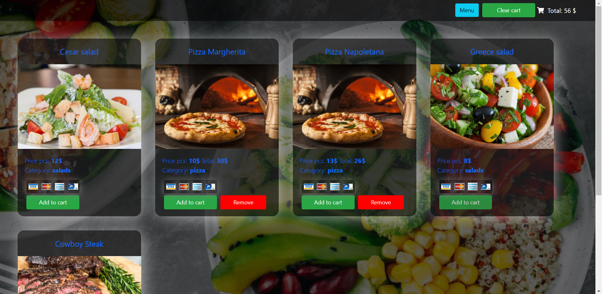

# React menu
SPA menu made with React (Redux). You can add and remove products from cart. Clear cart. And select product category.

> - [Live Demo](https://menu-app-pi.vercel.app/) :fries:

## Getting Started
This project is not necessary install special code or dependencys
- Clone or download this repo
- in terminal "json-server src/db.json" for render cards menu from json server on localhost://3000
- in terminal "npm start" for start project

## Practiced:
- React 
- Redux 
- json-server 
- database 
- HOC(Higher-Order Component)
- useState hook 
- Bootstrap, SCSS

## Authors
Kir Khorev

## License
This project is licensed under Unlicense license.
Copyright (c) 2021
